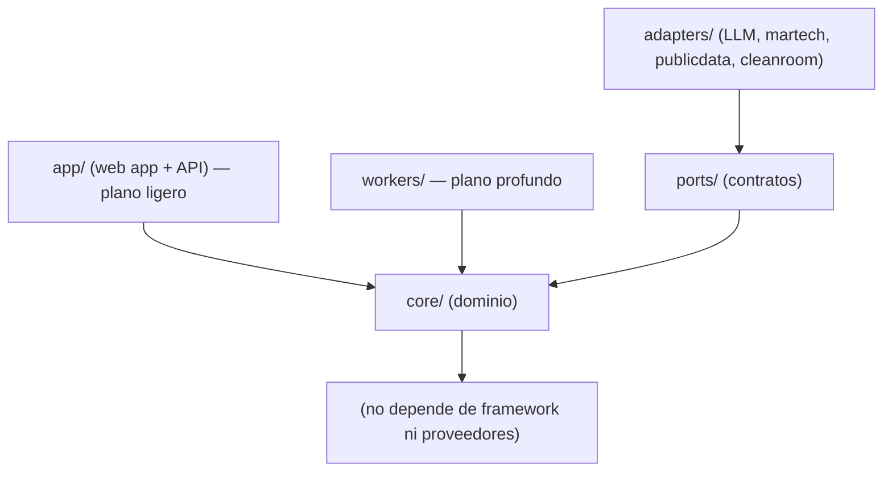
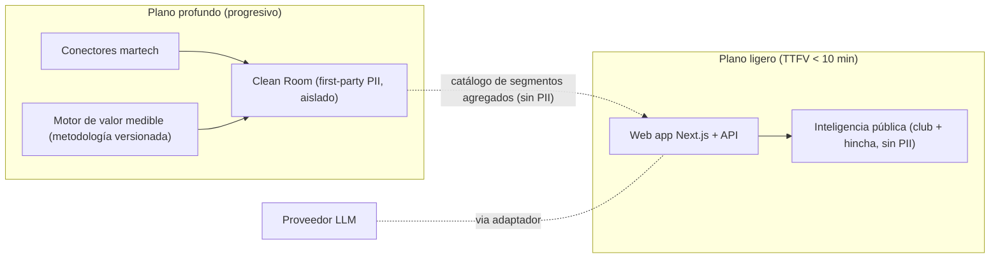
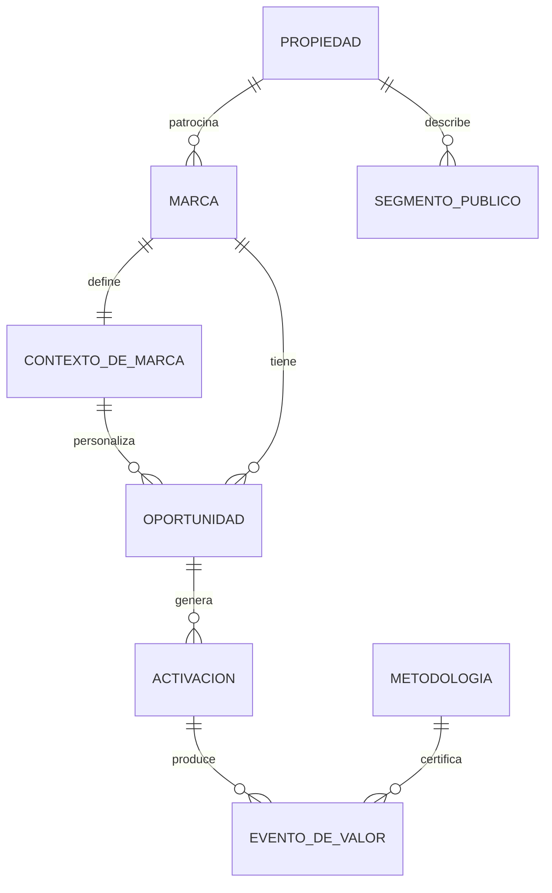

# Architecture Spine — Copiloto de Patrocinio Deportivo

## Design Paradigm

**Monolito modular de doble plano con puertos y adaptadores.** Un solo despliegue (rápido de construir, limpio para el handoff), organizado en módulos con fronteras explícitas. Dos planos funcionales conviven sobre un **núcleo de dominio** compartido:

- **Plano ligero (valor inmediato):** datos públicos → motor de oportunidades + generación IA → web app. Entrega valor en < 10 min sin PII ni integración enterprise.
- **Plano profundo (progresivo):** clean room (first-party PII), conectores martech, motor de valor medible. Corre en segundo plano y nunca bloquea al plano ligero.

Lo externo (LLM, Salesforce, Adobe, fuentes públicas, clean room) entra por **puertos** (contratos internos) implementados por **adaptadores** (hexagonal). El núcleo no conoce proveedores.

Mapa paradigma → directorios: `core/` (dominio), `ports/` (contratos), `adapters/` (proveedores), `app/` (web app + API, plano ligero), `workers/` (plano profundo), `data/` (esquemas Supabase).

## Invariants & Rules

### AD-1 — Doble plano sobre monolito modular [ADOPTED]
- **Binds:** todo; FR-14 (plano ligero) y FR-1/FR-2/FR-10/FR-11/FR-12/FR-13 (plano profundo).
- **Prevents:** que el TTFV (<10 min) se rompa por depender de la integración profunda.
- **Rule:** el plano ligero no puede tener ninguna dependencia (de código, datos o tiempo) sobre el plano profundo. El profundo *eleva* la precisión de forma asíncrona; nunca es prerrequisito del primer valor. **Degradación:** si el plano profundo falla o está pendiente, el ligero opera con el valor público y marca la precisión como "pendiente" — nunca un error bloqueante.

### AD-2 — Stack único TypeScript [ADOPTED]
- **Binds:** lenguaje, framework, BD, capa IA.
- **Prevents:** divergencia de stack y fricción en el handoff al desarrollador.
- **Rule:** TypeScript en todo el sistema; Next.js (App Router) + Supabase + Vercel AI SDK. Un worker Python solo puede añadirse en el plano profundo y siempre detrás de un puerto (AD-5).

### AD-3 — Frontera de datos: PII aislada en clean room [ADOPTED]
- **Binds:** ubicación y flujo de todo dato del fan; FR-1, FR-2.
- **Prevents:** fuga de PII a la marca o al plano ligero; incumplimiento GDPR.
- **Rule:** dos dominios de datos separados — *Inteligencia Pública* (sin PII) y *Clean Room* (PII, aislado). La PII nunca cruza la frontera hacia la marca ni al plano ligero; solo cruzan **segmentos agregados/anonimizados**.

### AD-4 — Valor medible: metodología versionada y eventos auditables [ADOPTED]
- **Binds:** FR-10, FR-11, FR-12; cómo se mide, certifica y cobra el valor.
- **Prevents:** juez-y-parte, sobre-atribución, disputas sin traza.
- **Rule:** la metodología de atribución es un artefacto **versionado y firmado**; todo evento de Valor medible referencia una versión y es **append-only auditable**; la certificación está **separada del cobro** (rol de auditoría/disputa independiente). No hay evento de valor sin versión referenciada; los eventos no se editan.

### AD-5 — Lo externo solo por adaptadores [ADOPTED]
- **Binds:** integración con LLM, Salesforce, Adobe, fuentes públicas, clean room; FR-13.
- **Prevents:** acoplamiento a un proveedor; bloqueo de la integración progresiva.
- **Rule:** el núcleo nunca llama al SDK de un proveedor; siempre vía un puerto con contrato interno estable. Añadir/cambiar un proveedor no toca el núcleo. Todo puerto que produzca efectos externos (publicar activación, sincronizar) usa **claves de idempotencia** y es seguro ante reintentos.

### AD-6 — Entornos en cadena y secretos fuera del repo [ADOPTED]
- **Binds:** despliegue y entornos.
- **Prevents:** secretos filtrados; drift entre entornos.
- **Rule:** local → preview (por cambio en GitHub) → producción (Vercel + Supabase gestionado). Todo secreto vive en variables de entorno; nunca en el repositorio.

### AD-7 — Una entidad, un módulo dueño de su estado [ADOPTED]
- **Binds:** FR-6, FR-7 y toda entidad de dominio; ciclo de vida borrador→aprobada→publicada de la Activación.
- **Prevents:** dos dueños de una misma entidad; conectores o workers mutando estado de forma inconsistente.
- **Rule:** cada entidad tiene **un único módulo dueño** que muta su estado: `Activacion`→`activations`, `Oportunidad`→`opportunities`, `EventoDeValor` y `Metodologia`→`attribution`. **Ningún worker ni adaptador escribe directo a tablas de dominio**: muta vía un caso de uso de `core/`, o escribe a una tabla de *staging* propia que `core/` promueve. Los adaptadores ejecutan, no deciden. Cada transición se registra con autor y fecha.

### AD-8 — Contrato del segmento agregado (anti re-identificación) [ADOPTED]
- **Binds:** FR-1, FR-2; toda salida del Clean Room hacia el plano ligero o la Marca.
- **Prevents:** re-identificación del fan por segmentos pequeños o por consultas diferenciales.
- **Rule:** el Clean Room expone un **catálogo cerrado de segmentos pre-agregados** (no consultas libres). El tipo `SegmentoAgregado` exige **k-mínimo** (umbral a fijar, p. ej. k≥50), supresión de celdas pequeñas, lista blanca de atributos y **prohibición de identificadores por-fan**. El puerto valida en runtime y rechaza cualquier payload bajo umbral.

### AD-9 — Identidad, roles y multi-tenant por Propiedad [ADOPTED]
- **Binds:** todo acceso a datos; hace cumplir AD-3 a nivel de fila.
- **Prevents:** que la Marca lea PII del Clean Room; que una Propiedad vea datos de otra.
- **Rule:** RBAC de los tres actores (Consultor, Propiedad, Marca) + **Row Level Security de Supabase** como frontera técnica que garantiza AD-3 (el rol Marca nunca puede leer filas del Clean Room). Aislamiento **multi-tenant por Propiedad**; el Clean Room exige aislamiento reforzado por Propiedad (más que una columna `tenant_id`).

### Dirección de dependencias (regla)



Regla: las flechas apuntan hacia el núcleo. El dominio (`core/`) no depende de nada externo; UI, workers y adapters dependen de él, nunca al revés.

## Consistency Conventions

| Concern | Convention |
| --- | --- |
| Nombres (entidades, archivos, interfaces, eventos) | Entidades del Glosario del PRD en singular (`Propiedad`, `Marca`, `Oportunidad`, `Activacion`, `EventoDeValor`); archivos `kebab-case`; interfaces/puertos con sufijo `Port` (`LlmPort`); eventos en pasado (`ActivacionPublicada`). |
| Datos y formatos (ids, fechas, errores, envolturas) | IDs `uuid` v4; fechas ISO-8601 UTC; respuestas de error con forma `{ error: { code, message } }`; dinero con moneda explícita. |
| Estado y transversales (mutación, errores, logging, config, auth) | Mutación de estado solo en `core/` (AD-7); auth vía Supabase + RLS (AD-9); logs estructurados; config por variables de entorno (AD-6); toda escritura a eventos de valor es append-only (AD-4). |
| Observabilidad | Métrica de **TTFV** instrumentada (es invariante de producto); trazas cruzando los puertos LLM/martech; alertas de la cola del plano profundo y del motor de valor medible. |

## Stack

| Name | Version |
| --- | --- |
| TypeScript | 5.x |
| Next.js (App Router, Turbopack) | 16.2.x |
| React | 19.x |
| Supabase (Postgres + Auth + Storage) | gestionado (Postgres 15+) |
| Vercel AI SDK | actual (verificar al iniciar build) |
| Proveedor LLM | Azure OpenAI / Google (vía AI SDK) |
| Tailwind CSS + shadcn/ui | actual |
| Plataforma de despliegue | Vercel (app) + Supabase (datos) |

> Seed verificado en jun 2026; el código es dueño de las versiones exactas una vez exista. Confirmar versiones vigentes al arrancar el build.

## Structural Seed

### Vista de contenedores



### Dominios de datos (ERD conceptual)



### Árbol de fuentes (scaffold)

```text
{root}/
  app/            # Next.js App Router — web app + API (plano ligero)
  core/           # dominio: context (marca/derechos), opportunities, activations, attribution, intelligence
  ports/          # contratos internos hacia lo externo
  adapters/       # llm, martech (salesforce/adobe), publicdata, cleanroom
  workers/        # procesos del plano profundo (progresivo)
  data/           # esquemas Supabase: inteligencia-publica (sin PII) | clean-room (PII)
  lib/            # utilidades compartidas
```

## Capability → Architecture Map

| Capacidad (PRD) | Vive en | Gobernada por |
| --- | --- | --- |
| FR-1/FR-2 Data servida / clean room | `adapters/cleanroom`, `data/clean-room` | AD-3, AD-5, AD-8, AD-9 |
| FR-15..FR-18 Contexto de marca y patrocinio | `core/context` | AD-7, AD-2 |
| FR-3/FR-4 Motor de oportunidades | `core/opportunities`, `core/intelligence`, `core/context` | AD-1, AD-3 |
| FR-5/FR-6 Generación IA + aprobación | `core/activations`, `adapters/llm` | AD-2, AD-5, AD-7 |
| FR-7 Activación self-serve | `core/activations`, `adapters/martech` | AD-7, AD-5 |
| FR-8/FR-9 Evidencia de ROI | `core/attribution`, `app/(app)` | AD-4 |
| FR-10/FR-11/FR-12 Valor medible + auditoría | `core/attribution` | AD-4 |
| FR-13 Conectores | `adapters/*`, `ports/*` | AD-5 |
| FR-14 Primer valor (TTFV) | `app/`, `core/intelligence` | AD-1 |

## Deferred

- **Worker Python para el plano profundo:** solo si el procesamiento de datos/atribución lo justifica; entra detrás de un puerto (AD-5). Razón: no es necesario para el MVP.
- **Atribución incremental avanzada (test/control, geo, holdouts):** v2; el MVP usa trazabilidad directa (Nivel 1). Razón: PRD §6.2.
- **Orden y profundidad de conectores (Salesforce vs Adobe primero):** lo fija el primer piloto. Razón: PRD — la integración sigue al piloto.
- **Forma exacta de datos / esquema detallado:** propiedad del código una vez exista (seed mínimo aquí).
- **Multi-deporte/multi-liga, multi-idioma:** fuera del MVP.
- **Estándar de evidencia de Nivel 2 (ciclo largo):** depende de P-2 (validar con un CFO); el motor (AD-4) lo soporta, la definición es de negocio.
